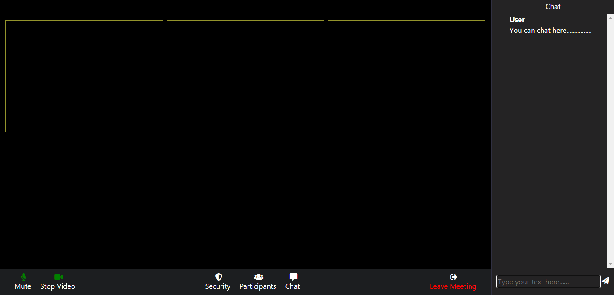
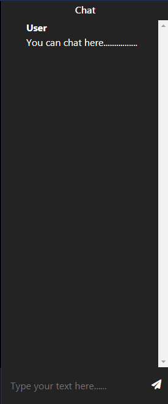

# ZOOM-CLONE
## This is a simple video calling application having the minimal requirements of making a video call by just sharing the links to the specific person
## Actual application

### Key features 
* Creating rooms 
* Muting the audio
* Muting the video
* Chat feature  
     
* Control pannel
    

#### Some of the suggested features are:
* Verification using the google OAuth2.0 
* Using the sessions 
* Adding some of the features to the main controls 
* Showing the avtar if the person mutes his video for the better user interface
* Adding responsivness

### _Deployment_ : https://we-video.herokuapp.com/ 
